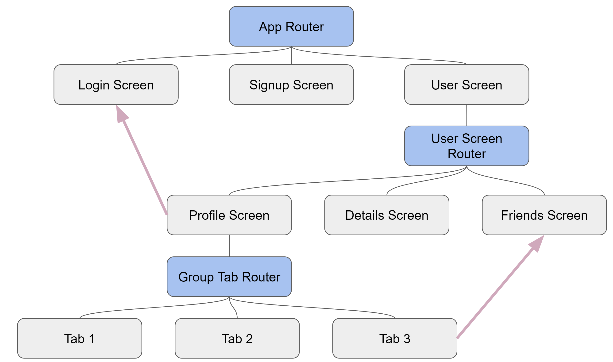

# Tutorial: Complex Flutter Navigation (Bottom bar and nested navigators) made easy with auto_route

A tutorial to show navigation in flutter using auto_route package and a complex navigation that include nested routers and bottom bar router.

## Tutorial

Find the tutorial here:

- [Tutorial](https://gbaccetta.medium.com/7f546d33fc4d?source=friends_link&sk=bfb493305125ca12a16c9ab0f4e40d80)

The auto_route package can be found here :

- [auto_route](https://github.com/Milad-Akarie/auto_route_library)

## Support me

If you want to support me, [buy me a coffee here](https://www.buymeacoffee.com/gbaccetta)